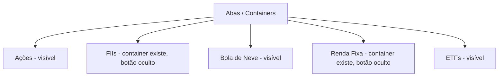

# 📋 Catálogo da Interface Atual (Interface Catalog)

Este documento cataloga as telas, abas, controles, métricas, dados e comportamentos presentes na interface atual do **B3 Screener** ([index.html](file:///c:/Nestjs/b3_screener/index.html)). Nenhuma dessas informações ou comportamentos deve ser quebrado ou perdido durante a reestruturação visual.

Base verificada em:
*   [`index.html`](file:///c:/Nestjs/b3_screener/index.html)
*   [`data.js`](file:///c:/Nestjs/b3_screener/data.js)

Snapshot de dados atual:
*   **Atualizado em**: `11/07/2026, 17:40:08`
*   **Ações**: `235`
*   **FIIs / Fiagros / Infra**: `189`
*   **ETFs**: `40`
*   **Tesouro Direto**: `37` títulos
*   **Benchmarks privados**: `4`

---

## 🏛️ 1. Estrutura Geral do Aplicativo (Layout & Global)

### Cabeçalho (Header)
*   **Título Principal**: `🚀 B3 Screener`.
*   **Data de Atualização**: Elemento `#lastUpdate`, preenchido com `data.updatedAt`.
*   **Layout**: Header `sticky` no topo, com superfície translúcida baseada em `--card-bg`, blur de fundo e borda inferior de 1px.
*   **Responsividade**: Em telas até 720px, o header passa para coluna; ações quebram linha e permanecem acessíveis.
*   **Busca Global**:
    *   Botão `🔍` abre/fecha a caixa de busca.
    *   Campo `#searchInput` com placeholder `Buscar (ex: PETR4, Tesouro)...`.
    *   Navegação entre resultados com botões `⬆️` e `⬇️`.
    *   Contador de resultados em `#searchCount`, no formato `atual/total`.
    *   Resultado ativo recebe destaque visual com a classe `.card-highlight`.
    *   A busca usa o atributo `data-search-term` dos cards renderizados.
    *   A aba FIIs oculta (`#content-fiis`) é excluída da busca.
*   **Menu de Download CSV**:
    *   Botão `📥` abre o menu `#downloadOptions`.
    *   Opções disponíveis: `Baixar Ações`, `Baixar FIIs`, `Baixar ETFs`.
    *   Arquivos gerados com nome `${type}_${YYYY-MM-DD}.csv`.
    *   O menu fecha ao clicar fora dele.
*   **Seletor de Tema**:
    *   Controle `<select>` com id `#themeBtn`.
    *   Opções atuais: `Origin Dark`, `Seline Light`, `UI Neutral`.
    *   Aplica classes no `body`: `theme-origin-dark`, `theme-seline-light`, `theme-ui-neutral`.
    *   Mantém fallback legado para valores salvos antigos `dark` e `light`.
    *   Persistência em `localStorage` nas chaves `theme` e `b3-theme`.
    *   A função global `toggleTheme()` permanece disponível como compatibilidade e alterna ciclicamente entre os temas.

### Componentes Globais de Interface
*   **Botões de ícone (`.btn-icon`)**: usados para busca e download; têm slot fixo de 40px, foco visível e hover via `--primary-soft`.
*   **Seletor de tema (`.theme-select`)**: controle de 40px de altura baseado em `--card-bg`, `--border-color` e `--radius-control`.
*   **Abas (`.tab-btn`)**: grid responsivo, altura mínima de 44px, estados hover/focus/active padronizados.
*   **Filtros (`.filter-btn`)**: botões em formato de pílula, altura mínima de 36px, `white-space: nowrap`, estado ativo com `--primary`.
*   **Badges (`.badge`, `.price-badge`)**: usam `--badge-bg`, `--radius-control`, borda do tema e cor funcional para destaque positivo.
*   **Inputs e busca (`.search-input`, `.search-btn`, `.search-container`)**: foco visível, raio por tema, container com sombra/token de superfície e layout com wrap no mobile.
*   **Menu de download (`.download-options`, `.download-option`)**: superfície temática, `--radius-card`, `--shadow-card` e linhas clicáveis com altura mínima.
*   **Links externos (`.external-link-btn`)**: botões em pílula com estados hover/focus preservados.
*   **Cards macro (`.metric-card`)**: usam tokens de raio/sombra e overlay sutil via `::before`, sem alterar os valores exibidos.
*   **Acessibilidade/foco**: `button`, `select`, `input` e `a` recebem `:focus-visible` com outline baseado em `--primary`.
### Métricas de Topo (Dashboard Banner)
Dois cartões principais (`metric-card`) exibem indicadores macroeconômicos vindos de `data.economy`. O layout atual usa grid de 2 colunas no desktop e 1 coluna em telas até 720px:
1.  **DÓLAR PTAX**: `#dollarVal`, exibido como `R$ X.XX`.
2.  **META SELIC**: `#selicVal`, exibida como `X.XX%`.

Após o dashboard, o JavaScript injeta uma linha contextual:
*   **Filtro DY Atual**: exibe `>4%` quando a Selic está acima de 10, ou `>6%` quando está normal.

### Resumo de Dados
O catálogo anterior citava um banner visual de resumo com totais de Ações/FIIs/ETFs. Na interface atual verificada, esses totais **não aparecem como componente visual próprio** no HTML; eles existem apenas nos dados (`data.js`) e foram registrados no snapshot acima.

---

## 🧭 2. Navegação por Abas (Tabs Navigation)

O aplicativo possui **5 containers de conteúdo** controlados por `showTab(tabName)`, mas apenas **3 abas aparecem visíveis** no cabeçalho de navegação.

### Abas Visíveis
*   **Ações**: `showTab('stocks')`, container `#content-stocks`.
*   **❄️ Bola de Neve**: `showTab('snowball')`, container `#content-snowball`.
*   **ETFs**: `showTab('etfs')`, container `#content-etfs`.

### Abas Ocultas por Estilo Inline
*   **FIIs**: botão com `style="display:none"`, container `#content-fiis`.
*   **Renda Fixa**: botão com `style="display:none"`, container `#content-fixed`.

### Comportamento
*   `showTab` oculta todos os containers adicionando `.hidden`.
*   Remove `.active` de todos os botões.
*   Exibe o container selecionado removendo `.hidden`.
*   Marca o botão ativo conforme o texto do botão.
*   Inicialização padrão: `showTab('stocks')`.
*   As abas visíveis usam grid de 3 colunas no desktop e 1 coluna em telas até 720px.
*   Os containers `.list-container` usam `repeat(auto-fill, minmax(min(100%, 320px), 1fr))` para evitar overflow em telas estreitas.

---

## 📈 3. Detalhamento dos Cards e Dados por Aba

### 3.1 Aba: Ações

Seções renderizadas:
*   `⭐ STARS - RENDA` com subtítulo `(Ouro: Dividendos Consistentes & Segurança)`.
*   `🚀 STARS - CRESCIMENTO` com subtítulo `(Ouro: Alta Eficiência & CAGR Receita)`.
*   `📉 STARS - VALOR` com subtítulo `(Ouro: Desconto Patrimonial & Upside Graham)`.
*   `📈 OPORTUNIDADES` com subtítulo `(Lucrativas & Valor Descontado)`.
*   `⚠️ EM ANÁLISE / RISCO` com subtítulo `(não são recomendações; exigem validação adicional)`.

#### Filtros da seção Oportunidades
Botões renderizados em `.opp-filters`:
*   `Ver Todas`
*   `💎 Quality`
*   `💰 Dividendos`
*   `📉 Valor/Desconto`
*   `🚀 Crescimento`
*   `🪄 Magic Formula`
*   `🔄 Turnaround`
*   `⚠️ Volatilidade`

Os filtros usam `data-strategies` e afetam apenas cards com `data-type="opportunity"`.

#### Conteúdo do Card de Ação (Minimizado)
Cards de ações recebem a classe adicional `.stock-equity` e usam a estrutura visual `equity-card-main`, sem alteração nos dados exibidos.

*   **Logo do ativo**: carregado de `https://raw.githubusercontent.com/thefintz/icones-b3/main/icones/{TICKER}.png`.
*   **Ticker**: exibido em `.equity-ticker` dentro de `.equity-ticker-stack`.
*   **Badges**: agrupadas em `.equity-badges`.
    *   `⚠️ Volatilidade` quando `strategies` inclui `HIGH_VOLATILITY`.
    *   `⚠️ Turnaround` quando `strategies` inclui `TURNAROUND` ou `pl < 0`.
    *   `⚠️ Risco Financeiro` quando `divida_ebitda > 3.5`.
    *   Badge de `risk_level`.
*   **Âncoras de valuation**: exibidas em `.valuation-strip` como pílulas compactas.
    *   `Graham: R$ ...`
    *   `Bazin: R$ ...`
*   **Métricas compactas**: agrupadas em `.equity-card-metrics`.
    *   Cotação (`cotacao`)
    *   Dividend Yield (`dividend_yield`)
    *   P/VP (`p_vp`)
    *   Score exibido:
        *   `score_income` nas stars de renda
        *   `score_growth` nas stars de crescimento
        *   `score_value` nas stars de valor
        *   `overall_score` ou `score` nos demais cards
*   **Responsividade**: até 520px, o bloco de métricas vai para baixo da identidade do ativo para evitar perda de texto.

#### Conteúdo Expandido do Card de Ação
Cards de ações abrem uma gaveta `.card-details` com carrossel de 2 slides.

Slide 1:
*   P/L
*   ROE
*   Graham Price
*   Bazin Price
*   Upside Graham
*   PSR
*   Última Data Com (`data_com`)
*   Último Pagamento (`data_pagamento`)
*   PEG
*   ROIC
*   Payout
*   Pilares: Qualidade, Valuation, Renda e Segurança
*   Gráfico TradingView (`TradingView.MediumWidget`) com ajuste por dividendos
*   Links externos: Investidor 10, TradingView e Investing.com

Slide 2:
*   P/VP
*   EV/EBIT
*   Margem Líquida
*   Liquidez 2 meses
*   Dívida / Patrimônio
*   Crescimento 5 anos

Indicadores podem receber setas de tendência (`↑`/`↓`) por `getTrendArrow`.

Implementação visual da Fase 5:
*   A gaveta expandida de ações é estilizada pelo escopo `.stock-card.stock-equity .card-details`, sem alterar os dados renderizados.
*   Grids técnicos usam `.detail-grid` responsivo com `repeat(auto-fit, minmax(126px, 1fr))` para manter os indicadores legíveis em desktop e mobile.
*   Caixas `.detail-box`, labels e valores usam tokens de tema, borda e superfície para separar métricas sem criar cards aninhados excessivos.
*   O gráfico usa `.chart-container` com altura controlada por `clamp(220px, 32vw, 300px)`.
*   Links externos quebram linha no mobile e preservam Investidor 10, TradingView e Investing.com.
*   Controles do carrossel foram estilizados, e cliques em anterior/próximo/dots devem alternar slides sem recolher o card.

---

### 3.2 Aba: FIIs (Container Oculto)

A aba FIIs existe no DOM e é renderizada, mas o botão de navegação está oculto por `style="display:none"`.

#### Filtros
*   `Ver Todos`
*   `🧱 Tijolo`
*   `📄 Papel`
*   `🌾 Fiagro/Agro`
*   `🔄 Multimercado`
*   `⚡ Infra`
*   `🛡️ Renda Segura`

#### Agrupamento
Os FIIs são agrupados por `type` na ordem:
*   `AGRO` → `🌾 Fiagro & Agronegócio`
*   `INFRA` → `⚡ Infraestrutura & Energia`
*   `TIJOLO` → `🧱 Tijolo (Ativos Reais)`
*   `PAPEL` → `📄 Papel (CRI/Recebíveis)`
*   `MULTI` → `🔄 Multimercado & FoF`
*   `OUTROS` → `📂 Outros Segmentos`

Os filtros também escondem ou mostram os cabeçalhos de grupo (`.group-header`).

#### Conteúdo do Card de FII (Minimizado)
*   Logo do FII.
*   Ticker.
*   Badge de tipo (`TIJOLO`, `PAPEL`, `AGRO`, `INFRA`, `MULTI`, `OUTROS`).
*   Badge de exposição (`exposure`) com tooltip de `classification_confidence`.
*   Badge de risco (`risk_level`).
*   Segmento (`segment`).
*   Preço (`price`).
*   DY (`dy`).
*   P/VP (`p_vp` ou `pvp`).
*   Score (`score`) com cor por faixa.

#### Conteúdo Expandido do Card de FII
*   Pilares: Valuation, Renda, Liquidez e Segurança.
*   FFO Yield.
*   Cap Rate.
*   Vacância.
*   Número de imóveis.
*   Liquidez diária.
*   Valor de mercado.
*   Última Data Com.
*   Último Pagamento.
*   Gráfico TradingView (`TradingView.MediumWidget`) com ajuste por dividendos.
*   Link externo para Investidor 10.

Implementação visual da Fase 7:
*   O visual dos FIIs ocultos é escopado por `#content-fiis .stock-card.fii`, evitando afetar ETFs que também reutilizam `.stock-card.fii`.
*   Cabeçalhos `.group-header` receberam tratamento visual de seção, mantendo `data-type` e a lógica de esconder/mostrar por filtro.
*   Cards de FIIs preservam logo, ticker, badges de tipo/exposição/risco, segmento, preço, DY, P/VP e score.
*   O expandido de FIIs preserva pilares, FFO Yield, Cap Rate, Vacância, Imóveis, Liquidez Diária, Valor de Mercado, datas de provento, TradingView e Investidor 10.
*   Grids técnicos usam `.detail-grid` responsivo com `repeat(auto-fit, minmax(132px, 1fr))` e ajuste para 2 colunas em telas até 520px.
*   A aba continua oculta na navegação, mas deve renderizar quando `showTab('fiis')` for chamado.

---

### 3.3 Aba: ❄️ Bola de Neve

A aba Bola de Neve é a principal interface visível para análise de FIIs por reinvestimento de dividendos.

#### Filtros
*   `Ver Todos`
*   `🧱 Tijolo`
*   `📄 Papel`
*   `🌾 Fiagro/Agro`
*   `🔄 Multimercado`
*   `⚡ Infra`
*   `🪙 Base 10`

#### Seções
Quando `Ver Todos` está ativo:
*   `🏆 Top 10 Melhores FIIs`, ordenado por `score` desc e depois `dy` desc.
*   `🪙 Base R$ 10 (Acessíveis)` para FIIs com preço abaixo de R$ 15.
*   `⚖️ Base R$ 20 - R$ 50 (Intermediários)` para FIIs com preço entre R$ 15 e R$ 70.
*   `💎 Base R$ 100+ (Premium/Tradicionais)` para FIIs com preço acima ou igual a R$ 70.

Quando filtros de tipo são usados:
*   Pode aparecer `⚡ Destaques (Fiagro & Infra)` para `AGRO` ou `INFRA`.
*   As seções de preço continuam sendo aplicadas conforme o filtro selecionado.

#### Conteúdo do Card Bola de Neve (Minimizado)
*   Ranking `#N` no Top 10.
*   Logo e ticker.
*   Badge de tipo (`Tijolo`, `Papel`, `Multi`, `Agro`, `Infra`).
*   Texto de efeito Bola de Neve:
    *   `Com X cotas, o dividendo paga +1 cota`.
    *   `⚠️ Sem distribuição atual` quando não há DY.
*   Valor patrimonial estimado: `VP: R$ price / p_vp`.
*   Preço Bazin estimado: `Bazin: R$ ((dy / 100 * price) / 0.06)` ou `Bazin: N/A`.
*   Preço atual.
*   DY.
*   Rendimento mensal estimado por cota (`~R$ X.XX /cota`).

#### Conteúdo Expandido do Card Bola de Neve
Cards da aba Bola de Neve usam carrossel de 2 slides.

Slide 1:
*   Investimento Total (Meta)
*   Renda Anual (Meta)
*   Renda Mensal (Meta)
*   Último Rendimento (`last_dividend`)
*   Liquidez Diária
*   P/VP
*   FFO Yield, quando disponível
*   Cap Rate, quando disponível
*   Vacância, quando disponível
*   Imóveis, quando disponível
*   Valor de Mercado, quando disponível
*   Última Data Com
*   Último Pagamento
*   Gráfico TradingView
*   Links externos: Investidor 10, TradingView e Investing.com

Slide 2:
*   `Central de Notícias`
*   Texto reservado para futuras integrações de notícias e fatos relevantes.

Implementação visual da Fase 6:
*   Cards da aba Bola de Neve recebem a classe adicional `.snowball-card`, mantendo a classe base `.stock-card`.
*   A camada visual é limitada ao escopo `.stock-card.snowball-card`, sem alterar Ações, FIIs, ETFs ou Renda Fixa.
*   O card minimizado preserva ranking Top 10, logo, ticker, badge de tipo, texto de efeito Bola de Neve, VP estimado, Bazin estimado, preço, DY e rendimento mensal por cota.
*   A gaveta expandida preserva o carrossel de 2 slides, métricas de meta, liquidez, P/VP, métricas imobiliárias opcionais, datas de provento, gráfico TradingView, links externos e Central de Notícias reservada.
*   Grids técnicos usam `.detail-grid` responsivo com `repeat(auto-fit, minmax(132px, 1fr))` e ajuste para 2 colunas em telas até 520px.
*   O gráfico usa `.chart-container` com altura controlada por `clamp(220px, 32vw, 300px)`.
*   Links externos quebram linha no mobile e os controles do carrossel usam os mesmos tokens visuais dos cards de ações.

---

### 3.4 Aba: ETFs

A aba ETFs está visível e combina benchmarks privados com a listagem de ETFs.

#### Seção `🏦 Referências (Benchmarks)`
Renderizada no topo da aba ETFs quando `data.fixedIncome.private` existe.

Campos:
*   Nome (`name`)
*   Tipo (`type`)
*   Taxa (`rate`)

#### Seção `📊 ETFs`
Lista os ETFs de `data.etfs`.

#### Conteúdo do Card de ETF (Minimizado)
*   Logo do ETF.
*   Ticker.
*   Texto fixo: `ETF de Renda Variável`.
*   Preço (`price`).
*   DY (`dy`) ou `N/A`.

#### Conteúdo Expandido do Card de ETF
*   Liquidez diária (`liquidity`).
*   Variação 12 meses (`variation_12m`).
*   Mínima de 52 semanas (`low_52w`).
*   Máxima de 52 semanas (`high_52w`).
*   Gráfico TradingView (`TradingView.MediumWidget`).
*   Link externo para Investidor 10.

Implementação visual da Fase 8:
*   Benchmarks privados recebem a classe adicional `.benchmark-card`, mantendo `.stock-card`.
*   ETFs recebem a classe adicional `.etf-card`, mantendo `.stock-card.fii` por compatibilidade com o código existente.
*   O visual da aba é escopado por `#content-etfs .benchmark-card` e `#content-etfs .etf-card`.
*   Benchmarks continuam no topo da aba ETFs e não foram movidos para Renda Fixa.
*   Cards minimizados de ETFs preservam logo, ticker, texto `ETF de Renda Variável`, preço e DY/N/A.
*   Cards expandidos preservam liquidez diária, variação 12 meses, mínima/máxima 52 semanas, TradingView e Investidor 10.
*   Grids técnicos usam `.detail-grid` responsivo com `repeat(auto-fit, minmax(132px, 1fr))` e ajuste para 2 colunas em telas até 520px.
*   A aba ETFs continua visível na navegação e abre sem depender de `showTab('fixed')`.

---

### 3.5 Aba: Renda Fixa (Container Oculto)

A aba Renda Fixa existe no DOM e é renderizada, mas o botão de navegação está oculto por `style="display:none"`.

#### Seção `🏛️ Tesouro Direto`
Renderiza `data.fixedIncome.tesouro`.

Campos exibidos:
*   Nome do título (`name`)
*   Data de vencimento (`maturity`)
*   Taxa (`rate`)
*   Investimento mínimo (`minInvest`)

Campo presente nos dados, mas não exibido no card atual:
*   Preço unitário (`price`)

Implementação visual da Fase 7:
*   Cards de Tesouro Direto recebem a classe adicional `.fixed-income-card`, mantendo `.stock-card`.
*   O visual é escopado por `#content-fixed .fixed-income-card`.
*   O card preserva nome do título, vencimento, taxa e investimento mínimo.
*   O preço unitário (`price`) continua não exibido para manter paridade com a interface catalogada.
*   A aba continua oculta na navegação, mas deve renderizar quando `showTab('fixed')` for chamado.

#### Crédito Privado / Benchmarks
Os benchmarks privados (`data.fixedIncome.private`) **não são exibidos na aba Renda Fixa atual**. Eles aparecem no topo da aba ETFs, na seção `🏦 Referências (Benchmarks)`.

---

## 📊 4. Dados, Campos e Exportação

### Origem de Dados da Interface
A interface consome `window.INVEST_DATA`, definido em `data.js`.

Estrutura principal:
*   `updatedAt`
*   `economy`
*   `stocks`
*   `fiis`
*   `etfs`
*   `fixedIncome`

### Campos Principais de Ações
*   `ticker`, `cotacao`, `pl`, `p_vp`, `psr`, `dividend_yield`
*   `ev_ebit`, `mrg_ebit`, `mrg_liq`, `roic`, `roe`
*   `liq_2meses`, `div_br_patrim`, `cresc_5a`
*   `payout`, `graham_price`, `upside`, `bazin_price`, `bazin_upside`
*   `strategies`, `eligibility`, `signal`, `risk_level`, `data_quality`
*   `pillars`, `overall_score`, `score`, `score_income`, `score_growth`, `score_value`
*   `category`, `is_star_income`, `is_star_growth`, `is_star_value`
*   `data_com`, `data_pagamento`, `divida_ebitda`, `dividends_last_3_years`

### Campos Principais de FIIs
*   `ticker`, `segment`, `price`, `ffo_yield`, `dy`, `p_vp`
*   `market_cap`, `liquidity`, `num_properties`, `cap_rate`, `vacancy`
*   `regulatory_class`, `exposure`, `classification_confidence`, `classification_reasons`
*   `type`, `eligibility`, `signal`, `risk_level`, `data_quality`
*   `pillars`, `overall_score`, `score`, `category`, `strategies`
*   `magicNumber`, `magicCost`, `last_dividend`
*   `external_segment`, `data_com`, `data_pagamento`, `data_sources`

### Campos Principais de ETFs
*   `ticker`, `price`, `dy`, `market_cap`, `variation_12m`, `liquidity`, `high_52w`, `low_52w`

### Campos de Tesouro Direto
*   `name`, `rate`, `minInvest`, `price`, `maturity`

### Campos de Benchmarks Privados
*   `name`, `rate`, `type`

### Exportação CSV
Disponível para:
*   Ações
*   FIIs
*   ETFs

Colunas prioritárias de Ações:
*   `ticker`, `signal`, `eligibility`, `risk_level`, `data_quality`, `overall_score`, `category`, `cotacao`, `dividend_yield`, `p_vp`, `score`, `upside`, `pl`, `roe`, `liq_2meses`, `graham_price`, `bazin_price`, `data_com`, `data_pagamento`

Colunas prioritárias de FIIs:
*   `ticker`, `regulatory_class`, `exposure`, `classification_confidence`, `signal`, `risk_level`, `overall_score`, `type`, `price`, `dy`, `p_vp`, `score`, `liquidity`, `vacancy`, `cap_rate`, `magicNumber`, `magicCost`, `last_dividend`, `segment`, `data_com`, `data_pagamento`

Colunas prioritárias de ETFs:
*   `ticker`, `price`, `dy`, `liquidity`, `high_52w`, `low_52w`, `variation_12m`

---

## 📉 5. Gráficos, Carrossel e Links Externos

### Gráficos TradingView
O HTML carrega:
*   `https://s3.tradingview.com/tv.js`

Os gráficos são criados sob demanda, apenas quando o card é expandido:
*   Ações: `TradingView.MediumWidget`
*   FIIs: `TradingView.MediumWidget`
*   ETFs: `TradingView.MediumWidget`
*   Top 10 Bola de Neve: `TradingView.widget`
*   Demais cards Bola de Neve: `TradingView.MediumWidget`

Configurações recorrentes:
*   Símbolo `BMFBOVESPA:{ticker}`
*   Locale `br`
*   Tema `dark`
*   Ajuste por dividendos
*   Tipo de gráfico `area` nos widgets médios

### Carrossel
*   Controlado por `moveSlide`, `goToSlide` e `updateCarousel`.
*   Estado salvo no objeto global `carouselStates`.
*   Cada carrossel assume **2 slides**.
*   Controles: botão anterior `❮`, dots e botão próximo `❯`.

### Links Externos
Função `getInvestidor10Url(item)` define o link:
*   `AGRO` → `https://investidor10.com.br/fiagros/{ticker}/`
*   `ETF` → `https://investidor10.com.br/etfs/{ticker}/`
*   Sem `type` → `https://investidor10.com.br/acoes/{ticker}/`
*   Demais FIIs → `https://investidor10.com.br/fiis/{ticker}/`

Alguns cards também exibem:
*   TradingView: `https://br.tradingview.com/symbols/BMFBOVESPA-{ticker}/`
*   Investing.com: `https://br.investing.com/search/?q={ticker}`

---

## 💾 6. Estrutura de Dados e Histórico (History)

O diretório `/history` armazena snapshots diários das execuções:
*   `*-fii-results.json`
*   `*-stock-results.json`

Esses dados históricos contêm evolução de preços, proventos, classificações e indicadores dos ativos. Devem ser preservados para permitir futuras visualizações de:
*   evolução de preço;
*   evolução de dividendos/proventos;
*   histórico de yield;
*   mudança de score/categoria;
*   gráficos de linha ou barras por ativo;
*   comparação entre snapshots.

---

## ⚠️ 7. Pontos de Atenção para Reestruturação Visual

*   Não remover `data-search-term`; a busca global depende dele.
*   Não remover os IDs dos containers `content-stocks`, `content-fiis`, `content-snowball`, `content-fixed`, `content-etfs`.
*   Não quebrar `showTab`, `filterOpportunities`, `filterFIIs`, `filterSnowball`, `moveSlide` e `goToSlide`.
*   Preservar `#searchContainer`, `#searchInput`, `#searchCount`, `#downloadMenu`, `#downloadOptions`, `#themeBtn`, `#lastUpdate`, `#dollarVal`, `#selicVal`.
*   A aba FIIs e a aba Renda Fixa existem, mas seus botões estão ocultos. Qualquer nova UI precisa decidir explicitamente se elas permanecem ocultas ou voltam para a navegação.
*   Benchmarks privados aparecem hoje na aba ETFs, não na aba Renda Fixa.
*   O preço unitário do Tesouro Direto existe nos dados, mas não é exibido atualmente.
*   Cards expandidos dependem de renderização sob demanda do TradingView; mudanças no DOM precisam manter IDs únicos dos containers de gráfico.
*   A classe `.stock-card.fii` é reutilizada também em ETFs.

---

## 8. Contrato de extensão histórica — Fase 9

A interface expõe `window.B3_HISTORY_EXTENSION` como contrato preparatório versionado. Este objeto não carrega arquivos e não renderiza gráficos.

### Contrato público

- `version`: versão do contrato; valor atual `1`.
- `directory`: diretório lógico `history/`.
- `filePatterns.stock`: `{YYYY-MM-DD}-stock-results.json`.
- `filePatterns.fund`: `{YYYY-MM-DD}-fii-results.json`.
- `assetTypes`: `stock`, `fund` e `etf`.
- `metrics`: campos candidatos por classe de ativo.
- `mountSelector`: seletor `[data-history-mount]`.

### Pontos de montagem

Cards expansíveis possuem:

- `data-history-asset-type` no card;
- `data-history-ticker` no card;
- um descendente oculto `[data-history-mount]` dentro de `.card-details`;
- `data-history-status="not-loaded"` enquanto não existe implementação histórica.

Os mounts são intencionalmente invisíveis e não alteram dimensões, interação ou conteúdo dos cards. Uma implementação futura deve carregar dados sob demanda, validar a série e só então tornar o mount visível.
### Invariantes verificadas

- Todo `.stock-card` que contém `.card-details` deve possuir exatamente um `[data-history-mount]`.
- Card e mount devem repetir o mesmo `data-history-asset-type` e `data-history-ticker`.
- O tipo deve pertencer a `window.B3_HISTORY_EXTENSION.assetTypes`.
- Enquanto não houver série histórica válida, o mount permanece `hidden`, `aria-hidden="true"` e com status `not-loaded`.
- O contrato público e suas coleções são imutáveis; mudanças incompatíveis exigem incremento de `version`.

### Restrições de dados

- O navegador não pode listar o conteúdo de `/history`, especialmente quando o dashboard é aberto por `file://`.
- Deve ser gerado previamente um manifesto ou artefato agregado com as séries disponíveis.
- Snapshots vazios, pequenos ou estruturalmente incompletos não podem entrar na série.
- Ausência de valor não equivale a zero.
- ETFs ainda não possuem snapshots históricos dedicados no acervo atual.
- A data canônica vem do nome do snapshot; fins de semana e dias sem pregão precisam de política explícita.

### Visual futuro

A referência permanece Ventriloc: linha fina, pouca cor, destaque funcional e sem elementos decorativos. Os gráficos previstos continuam no backlog: preço, DY, score, categoria e comparação com Selic/CDI.
Validação final da revisão da Fase 9 em 2026-07-12:

- `node --check`: aprovado para o smoke test e entry points verificados.
- `npm test`: 104 testes aprovados, 0 falhas.
- `npm run audit:data`: aprovado com 235 ações e 189 fundos.
- `npm run test:ui`: aprovado em 1280x900 e 375x812, sem erros relevantes de console e sem overflow horizontal.
- Auditoria histórica: 684 cards expansíveis, 684 cards registrados, 684 mounts, 0 mounts inválidos e 0 mounts visíveis.
- Distribuição dos mounts: 256 `stock`, 388 `fund` (FIIs e Bola de Neve) e 40 `etf`.
- `git diff --check`: aprovado; resta apenas o aviso conhecido de futura normalização LF para CRLF em `index.html` no Windows.
- Mensagens de erro/warning observadas no teste unitário pertencem a casos negativos deliberados (falha de adapters e entrada Selic inválida) e as respectivas asserções passaram.
---

## 9. Contrato de QA funcional — Fase 10

O smoke test oficial é `npm run test:ui`, implementado por `scripts/playwright-smoke.js`. Ele abre diretamente o dashboard por `file://` e deve reprovar o processo quando qualquer invariante funcional falhar.

### Matriz responsiva obrigatória

- 320x720
- 375x812
- 414x896
- 768x1024
- 1024x768
- 1280x900

### Invariantes funcionais

- `window.INVEST_DATA` contém ações, FIIs e ETFs.
- Todos os cards possuem `data-search-term`.
- As funções globais catalogadas continuam disponíveis.
- Tema `theme-seline-light` persiste após reload.
- Busca consegue destacar um ETF e ativar sua aba.
- `downloadCSV` gera arquivos datados para `stocks`, `fiis` e `etfs`.
- Filtros mantêm estado ativo e atualizam a visibilidade dos cards.
- Cards podem expandir e recolher.
- Carrossel pode avançar e retornar sem recolher o card.
- A expansão solicita o widget TradingView.
- Links externos usam HTTPS e `target="_blank"`.
- Hover não altera largura ou altura do card em mais de 2 px.
- Nenhum viewport pode apresentar overflow horizontal.
- Erros de console não relacionados a recursos externos conhecidos reprovam o teste.

### Resultado de referência em 2026-07-12

- 725 cards renderizados em cada viewport.
- 0 cards sem `data-search-term`.
- 0 links externos inválidos.
- 0 funções globais obrigatórias ausentes.
- CSV validado para as três classes.
- Todos os critérios funcionais aprovados nos seis viewports.
- 0 erros relevantes de console e 0 overflow horizontal.
---

## 10. Estado consolidado da interface — Fase 11

A primeira entrega visual UI_MODERN está concluída. O dashboard permanece estático e abre diretamente nos dados, com paridade funcional preservada.

### Temas suportados

- `theme-origin-dark`
- `theme-seline-light`
- `theme-ui-neutral`

Todos devem aplicar os tokens centrais, sincronizar o seletor e persistir nas chaves `theme` e `b3-theme`. O valor legado `light` aponta para Seline; valores desconhecidos retornam ao Origin Dark.

### Componentes consolidados

- Header responsivo com atualização, busca, CSV e tema.
- Métricas macroeconômicas.
- Abas visíveis de Ações, Bola de Neve e ETFs.
- Containers ocultos de FIIs e Renda Fixa preservados.
- Cards minimizados e expandidos de ações.
- Cards e filtros da Bola de Neve.
- Cards de FIIs, renda fixa, benchmarks e ETFs.
- Carrosséis, TradingView e links externos.
- Contrato inerte da extensão histórica.

### Critério de manutenção

Mudanças futuras não podem remover IDs, atributos de busca/filtro, funções globais ou informações catalogadas sem atualizar este contrato e o smoke test. Alterações incompatíveis no contrato histórico exigem incremento de versão.
Validação final da Fase 11 em 2026-07-12:

- `npm run test:ui`: aprovado nos seis viewports com os três temas, fallbacks, fluxos funcionais, 0 erros relevantes de console e 0 overflow horizontal.
- `npm test`: 104 testes aprovados, 0 falhas.
- `npm run audit:data`: aprovado com 235 ações e 189 fundos.
- `node --check`: aprovado para smoke test, exportador e entry point.
- `git diff --check`: aprovado; permanece somente o aviso conhecido de futura conversão LF para CRLF em `index.html`.
- Varredura por `TODO`, `FIXME` e `HACK`: nenhuma ocorrência.
- Logs de transformação inválida, Selic inválida e adapters indisponíveis em `npm test` são cenários negativos intencionais e passaram nas respectivas asserções.
---

## 11. Encerramento e proteção contínua

A implementação UI_MODERN está finalizada no escopo definido. O backlog pós-implementação continua separado e não é requisito desta entrega.

### Contrato estável das abas

Cada `.tab-btn` possui `data-tab` com uma das chaves `stocks`, `fiis`, `snowball`, `fixed` ou `etfs`. A função `showTab(tabName)` controla visibilidade e estado `.active` por essa chave, sem depender do texto traduzido do botão. A inicialização deve manter `stocks` visível e ativo.

### Comandos oficiais de validação

- `npm test`: regras de domínio e serviços.
- `npm run test:e2e`: suíte Playwright declarativa em `tests/dashboard.spec.js`.
- `npm run test:ui`: smoke funcional completo, temas e matriz responsiva.
- `npm run audit:data`: consistência dos dados gerados.

### Proteção no CI

O workflow diário instala dependências, executa testes de domínio, instala Chromium, executa o smoke UI, gera os dados e audita as classificações antes de publicar. Uma falha visual ou funcional impede a atualização automática de `data.js` e `history/`.

### Resultado final de referência

- 104 testes de domínio aprovados.
- 5 testes E2E aprovados.
- Smoke UI aprovado em 320, 375, 414, 768, 1024 e 1280 px.
- Três temas e fallbacks aprovados.
- 725 cards com busca válida e 684 mounts históricos íntegros.
- 0 erros relevantes de console e 0 overflow horizontal.

### 2026-07-12 — Homologação Final da Interface

Interface validada e homologada por Antigravity (Gemini). Todos os testes unitários, funcionais E2E e visuais em múltiplos viewports passaram com sucesso absoluto. O comportamento das abas reestruturadas com `data-tab` está estável, garantindo a integridade de todas as seções e filtros.

### 2026-07-12 — Atualização do Tema Padrão para Seline Light

- O tema padrão (fallback e inicialização) foi alterado de `theme-origin-dark` para `theme-seline-light` (Seline Light).
- A tag `<body>` agora inicia com a classe `theme-seline-light` para evitar oscilações visuais durante o carregamento.
- Testes automatizados atualizados e validados.

### 2026-07-12 — Ajustes do Banner de Indicadores Macroeconômicos (Dashboard)

- **Layout e Alinhamento**: A largura das colunas do dashboard foi limitada a no máximo 300px com `justify-content: center`, garantindo que "DÓLAR PTAX" e "META SELIC" estejam centralizados perfeitamente no desktop.
- **Responsividade Mobile**: Removido o empilhamento vertical para telas pequenas. Agora os cards ficam lado a lado (2 colunas) em todas as resoluções.
- **Espaçamento e Padding**: O padding interno dos cards foi reduzido em telas estreitas usando `clamp(0.75rem, 2vw, 1.5rem)` para evitar quebra de linha de valores.

### 2026-07-12 — Sincronização do Gradiente das Abas e Responsividade

- **Gradiente nos Botões**: O botão da aba ativa (`.tab-btn.active`) agora adota o mesmo gradiente visual dos cards macro (`var(--card-gradient)`), a cor do texto compatível `var(--text-color)` e o sombreamento `var(--primary-glow)`.
- **Alinhamento Mobile**: Removido o grid columns stacking para `.tabs` no breakpoint de 720px, garantindo que as três abas ativas fiquem alinhadas lado a lado em dispositivos móveis.
- **Validação de Testes**: Ajustada a suite Playwright para usar locators baseados no atributo `data-tab="..."` e propriedades de visibilidade em vez de textos, acomodando customizações textuais na interface.

### 2026-07-12 — Filtros Rápidos na Visualização de Ações

- **Filtros do Topo da Aba Ações**: Criados filtros horizontais estilizados como `.opp-filters.top-stock-filters` com os botões "Ver Todas", "💰 Renda", "🚀 Crescimento", "📉 Valor", "📈 Oportunidades", "⚠️ Risco/Revisão", seguindo o design e comportamento dos filtros da aba FIIs.
- **Estruturação de Dados com data-type**: Todos os cards e headers de grupos na aba de ações ganharam o atributo `data-type` correspondente, permitindo ocultar/exibir seções inteiras instantaneamente.
- **Compatibilidade de Seletores no Playwright**: Renomeada a classe interna de subfiltros da seção de Oportunidades para `.opp-sub-filters` para evitar ambiguidade e conflitos de clique com o contêiner superior nos testes automáticos.

### 2026-07-12 — Ajustes de Botões, Overflow Mobile e Badges da UI

- **Botão de Temas Compacto**: O seletor `#themeBtn` foi ocultado visualmente e sobreposto a um botão de ícone contendo um emoji de seta para baixo (`🔽`), mantendo a funcionalidade de cliques nativa do dropdown e reduzindo o consumo de espaço no cabeçalho.
- **Prevenção de Transbordo (Overflow)**: A caixa de busca ativa no mobile passa a usar `right: 0; left: auto;` no breakpoint de 720px para conter a renderização do input e evitar o overflow horizontal da página.
- **Alinhamento de Badges**:
  - Nas Ações, as badges de volatilidade, turnaround e risco geral são dispostas horizontalmente lado a lado com o ticker do ativo em todas as resoluções (`.equity-ticker-stack` com `flex-direction: row`).
  - Nos FIIs e na aba Bola de Neve, as colunas do grid `.list-container` no desktop são estendidas para a largura mínima de `360px`, e a regra `.ticker-info h3` com `flex-wrap: nowrap` é forçada no desktop para garantir que badges como "🧱 Tijolo" e "📄 Papel" permaneçam ao lado do ticker sem sofrer quebra de linha.
  - No mobile, FIIs e Bola de Neve mantêm a estrutura side-by-side com a cotação no canto superior direito e os subindicadores alinhados à direita, e a classe `.badge-text` oculta textos redundantes de tipo (ex: mostrando apenas o emoji "🧱") e risco (ex: mostrando apenas "LOW").
- **Exibição dos Gráficos (TradingView)**: Os contêineres `.chart-container` nas 4 abas passam a ter altura fixa de `300px` em todas as resoluções de tela para garantir a renderização completa dos componentes e evitar o corte horizontal dos gráficos do TradingView.
- **Botão Voltar ao Topo (Mobile)**: Botão flutuante circular `#back-to-top` (`46px x 46px`) posicionado no canto inferior direito (`bottom: 20px; right: 20px;`) visível apenas no mobile (breakpoint <= 720px) ao rolar a página verticalmente além de 300px. Executa rolagem suave ao topo.
---

## 12. Dashboard histórico independente

### Entradas públicas

- Página: `history-dashboard.html`.
- Dados: `history-data.js`, exposto como `window.B3_HISTORY_DATA`.
- Estilos: `assets/history-dashboard.css`.
- Aplicação: `assets/history-dashboard.js`.

A página não depende do DOM, CSS ou JavaScript de `index.html` e pode evoluir separadamente.

### Contrato `B3_HISTORY_DATA`

- `meta.version`: versão atual `1`.
- `meta.generatedAt`: timestamp mais recente aceito.
- `meta.range`: primeira e última data canônica.
- `meta.sourceFiles`, `accepted`, `rejected` e `assets`: auditoria do acervo.
- `fields.stock` e `fields.fund`: ordem das colunas.
- `dates`: calendário compartilhado.
- `economy`: tuplas `[dateIndex, selic, dollar]`.
- `series.stock[ticker]` e `series.fund[ticker]`: `{ d, v }`, em que `d` contém índices de data e `v` contém os valores na ordem de `fields`.

### Campos de ações

`price`, `dy`, `score`, `pvp`, `signal`, `category`, `roe`, `roic`, `liquidity`, `graham`, `bazin`, `payout`, `growth`.

### Campos de fundos

`price`, `dy`, `score`, `pvp`, `signal`, `category`, `liquidity`, `marketCap`, `vacancy`, `ffoYield`, `capRate`, `fundType`, `exposure`.

### Seletores e elementos críticos

- `#assetType`, `#assetSearch`, `#compareAsset`, `#metricSelect`, `#periodSelect`.
- `#mainChart`, `#miniCharts`, `#timeline`, `#macroChart`.
- `#rankingGrid`, `#qualityGrid`, `#rejectedList`.
- `#themeToggle`, `#downloadCsv`.

### Regras visuais

- Gráficos usam SVG nativo, linha fina e cor funcional.
- Comparações são normalizadas em percentual para evitar escalas incompatíveis.
- Valores ausentes produzem lacunas; não são plotados como zero.
- Tema escuro é persistido em `localStorage.b3-history-theme`.
- Não pode haver overflow horizontal a partir de 320 px.

### Publicação

O GitHub Pages deve publicar `history-dashboard.html`, `history-data.js` e `assets/` no mesmo diretório relativo. O navegador nunca tenta listar `history/`; toda descoberta ocorre no build Node.
Validação final do dashboard histórico em 2026-07-12:

- `npm test`: 108 testes aprovados, incluindo 4 testes do agregador histórico.
- `npm run audit:data`: aprovado com 235 ações e 189 fundos.
- `npm run audit:history`: artefato válido e atualizado.
- `npm run test:e2e`: 5 testes aprovados no dashboard principal.
- `npm run test:ui`: aprovado nos seis viewports; novo link histórico presente; 0 erros relevantes.
- `npm run test:history-ui`: aprovado em 320x720, 768x1024 e 1280x900.
- Smoke histórico validou troca de classe, ticker, métrica, período, comparação, URL, rankings, rejeições, CSV, tema persistente e ausência de overflow.
- Parsers JavaScript e JSON: aprovados.
- `git diff --check`: aprovado; apenas warnings conhecidos de LF para CRLF em arquivos existentes no Windows.
- Varredura por `TODO`, `FIXME`, `HACK`, `NaN` e `Infinity`: nenhuma ocorrência na nova implementação.
- O navegador visual integrado não estava disponível na sessão; a verificação real foi executada em Chromium headless pelo Playwright.

Warnings operacionais:

- `console.error` e códigos de saída não zero existem apenas nos caminhos de falha do gerador e dos testes, para bloquear CI corretamente.
- Logs negativos já conhecidos dos testes de adapters e entradas inválidas continuam intencionais e com asserções aprovadas.
- Nenhum erro de console foi observado na nova página.
Ajuste da busca global de Ativo principal em 2026-07-12:

- `#assetOptions` passou a reunir 246 ações e 208 fundos, totalizando 454 tickers pesquisáveis independentemente da classe ativa.
- Cada sugestão identifica sua classe como `Ação` ou `Fundo`.
- Ao selecionar ticker de outra classe, a página troca automaticamente `state.type`, redefine a métrica para preço e remove comparação incompatível.
- Selecionar ticker da classe atual preserva classe e métricas, removendo apenas comparação com o próprio ativo quando necessário.
- Placeholder informa que a busca cobre ações e fundos.
- Smoke Playwright validou as 454 opções e a transição Fundos → PETR4 → Ações em 320, 768 e 1280 px.
- Resultado: 3 viewports aprovados, 0 erros de console e 0 overflow horizontal.
